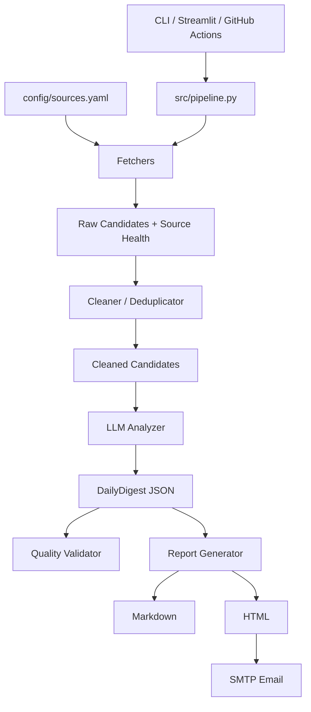

# ai-news-digest-agent

A lightweight AI news digest pipeline that turns multi-source candidates into daily Chinese Markdown/HTML reports and optional email delivery.

## Three-line Overview
- Collects public AI signals (news, research, open-source, community) into normalized candidates.
- Uses a single pipeline (`fetch -> clean -> analyze -> report -> email`) reused by CLI, Streamlit, and GitHub Actions.
- Optimized for local-first operation with minimal dependencies and no database/login/backend service.

## Features
- Modular pipeline in `src/pipeline.py`
- CLI orchestration (`cli.py`)
- Streamlit dashboard (`app.py`)
- SMTP email sending with recipient override/group support
- Local recipient management via `data/recipients.local.json`
- GitHub Actions scheduled/manual automation
- Markdown + HTML report generation
- LLM JSON repair/normalization safeguards
- Program-side digest shape enforcement for 24h/48h/72h windows
- Deterministic quality report (`outputs/quality/*quality_report.json`)
- Source health snapshots for fetch/clean observability
- Main item summaries include event summary, mechanism, importance, and trend insight

## Architecture


## Quick Start
```bash
python -m pip install --upgrade pip
pip install -r requirements.txt
copy .env.example .env
python cli.py status
python cli.py run-pipeline
python cli.py quality
python cli.py send-email
streamlit run app.py
```

## Configuration
- Runtime env file: `.env` (never commit)
- Source config: `config/sources.yaml`
- Digest policy: `config/digest_policy.yaml`
- Recipient local file: `data/recipients.local.json` (local only)
- Recipient example file: `config/recipients.example.json`

`DEEPSEEK_*` and `QWEN_*` in `.env.example` are **reserved/future** fields. Current LLM runtime implementation is `LLM_PROVIDER=zhipu`.

## GitHub Actions Setup
- Workflow: `.github/workflows/daily_digest.yml`
- Schedule: non-top-of-hour (`UTC 14:17`) to reduce queue spikes.
- Required repo secrets include LLM + SMTP + recipient envs used in workflow.
- `workflow_dispatch` supports:
  - `topic` (override digest topic)
  - `send_email` (true/false)
  - `llm_limit` (0 uses env default)
- If `send_email=false`, workflow only generates reports and artifacts.

## Recipient Management
- Local recipient list: `data/recipients.local.json`
- Use `config/recipients.example.json` as template.
- Real emails must stay local and must not be committed.
- CLI examples:
```bash
python cli.py send-email --to a@qq.com,b@qq.com
python cli.py send-email --group default
python cli.py run-pipeline --send-email --group default
```

## Manual Verification
```bash
python cli.py preflight --mode local
python -m py_compile app.py cli.py src/config.py src/pipeline.py src/processors/analyzer.py src/processors/prompts.py src/processors/cleaner.py src/processors/deduplicator.py src/processors/candidate_scorer.py src/processors/digest_validator.py src/generators/report_generator.py
pytest -q
python tests/manual_test_digest_shape.py
python tests/manual_test_report_statistics.py
python tests/manual_test_digest_quality.py
python tests/manual_test_config_models.py
python tests/manual_test_fetchers.py
python tests/manual_test_cleaner.py
python tests/manual_test_llm.py
python tests/manual_test_report.py
python tests/manual_test_email.py
python tests/manual_test_pipeline.py
python tests/manual_test_recipients.py
python tests/manual_test_config_runtime.py
```

## Streamlit
```bash
streamlit run app.py
```
- Use pages for overview, digest runs, latest report, history, source health, and recipient management.
- Latest Report includes Structured View, Full Markdown, and HTML Preview.
- Structured View is grouped by category and shows summary, mechanism, why-it-matters, insights, source names, and labeled links.

## Quality And Observability
- `src/processors/analyzer.py` enforces main/appendix caps after LLM output and before save.
- `src/processors/digest_validator.py` checks length, language, duplicate links, HN concentration, source concentration, Chinese coverage explanation, and weak AI relevance.
- `data/raw/*_source_health.json` records source status, raw count, cleaned count, duration, endpoint, and error.
- `data/index.json` is a local-only lightweight run history index. It is ignored by git.
- Quality checks are warnings by default; use `python cli.py quality --strict` when you want failures to exit non-zero.

## Sample Reports
- Markdown reports are written to `outputs/markdown/`.
- HTML reports are written to `outputs/html/`.
- Quality reports are written to `outputs/quality/`.
- Runtime outputs are ignored by git except `.gitkeep` placeholders.

## Screenshots
Recommended paths:
- `docs/assets/streamlit-demo.png`
- `docs/assets/email-demo.png`
- `docs/assets/report-demo.png`

## Limitations
- Provider support is currently centered on Zhipu-compatible API.
- Free-tier models may hit timeout/rate limits.
- Some upstream feeds can become unstable.
- Chinese source coverage depends on public feeds staying available and passing relevance filters.
- The quality validator is deterministic and conservative; warnings require human judgment.
- Schedule automation is suitable for daily digest, not high-precision cron jobs.

## Roadmap
- Better source-specific health diagnostics and retry hints
- More offline pytest coverage for renderers and recipient parsing
- Better screenshot examples under `docs/assets/`
- Future provider extensions (DeepSeek/Qwen)

## Security / Repo Hygiene
- Never commit `.env` or any real secrets.
- Never commit runtime artifacts under `outputs/`.
- Never commit local recipient real data (`data/recipients.local.json`).
- Keep `data/cache` and `data/clustered` as local runtime/debug data.
