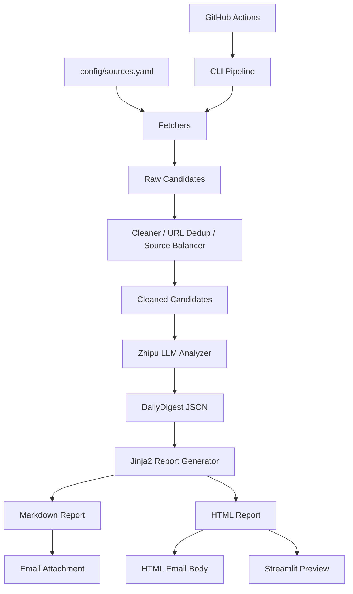

# ai-news-digest-agent

AI News Digest Agent is a modular AI-powered digest pipeline that collects public AI news, research papers, open-source signals, and industry updates, then uses an LLM to generate structured Chinese Markdown/HTML reports with optional email delivery, Streamlit UI, CLI, and GitHub Actions automation.

## Current Status
- Module 0-9 completed and verified locally.
- Optimization Round 1 completed: research/industry balance, source balancing, JSON repair, digest policy.

## Content Strategy
This project is designed as a **research + industry trend digest**, not a paper-only summary list.

It combines:
- AI research progress
- AI technology and model updates
- Agent / AI tooling trends
- company and industry dynamics
- open-source ecosystem signals
- compute/chip/infrastructure signals
- safety/policy/regulation updates

## Architecture


## Demo Output
A typical digest structure includes:
- 技术与模型进展
- 科研与论文前沿
- Agent 与 AI 工具
- 产业与公司动态
- Appendix

## Sources / Data Sources
The source list is managed in `config/sources.yaml`.

- Stable endpoints are enabled by default.
- Unverified endpoints stay `enabled: false` with TODO notes.
- Public content only: no login/paywall/captcha bypass.

## Screenshots
Screenshots can be added under `docs/assets/`.

Planned files:
- `docs/assets/streamlit-demo.png`
- `docs/assets/email-demo.png`
- `docs/assets/report-demo.png`

## Configuration
- `.env`: runtime secrets/config (never commit)
- `config/sources.yaml`: source definitions and enable flags
- `config/digest_policy.yaml`: balancing quotas and digest policy

## Manual Verification
```bash
python tests/manual_test_config_models.py
python tests/manual_test_digest_policy.py
python tests/manual_test_fetchers.py
python tests/manual_test_cleaner.py
set LLM_TEST_CANDIDATE_LIMIT=10
python tests/manual_test_llm.py
python tests/manual_test_report.py
python tests/manual_test_email.py
python tests/manual_test_pipeline.py
streamlit run app.py
```

## Limitations
- Free/flash LLM models may hit 429 / timeout.
- Some source feeds may change, timeout, or return 404.
- No database persistence in current version.
- No historical trend RAG in current version.
- No bypass of login/paywall/captcha/strong anti-bot controls.
- GitHub Actions requires repository Secrets configuration.

## GitHub Actions Daily Email Setup
- This project supports automatic daily digest generation and email delivery via GitHub Actions.
- Workflow file: `.github/workflows/daily_digest.yml`
- Schedule: `UTC 14:17` (about `22:17` in Beijing/Singapore time).
- Configure repository secrets at: `Settings -> Secrets and variables -> Actions`.
- Required Secrets:
  - `DIGEST_TOPIC`
  - `DIGEST_LOOKBACK_HOURS`
  - `MAX_LLM_CANDIDATES`
  - `MAIN_DIGEST_MIN_ITEMS`
  - `MAIN_DIGEST_MAX_ITEMS`
  - `LLM_PROVIDER`
  - `ZHIPU_API_KEY`
  - `ZHIPU_BASE_URL`
  - `ZHIPU_MODEL`
  - `GITHUB_TOKEN`
  - `SMTP_HOST`
  - `SMTP_PORT`
  - `SMTP_USE_SSL`
  - `SENDER_EMAIL`
  - `SMTP_AUTH_CODE`
  - `RECIPIENT_EMAIL`
  - `DEFAULT_SEND_TIME`
  - `TIMEZONE`
- Manual run (`workflow_dispatch`): open `Actions`, choose `Daily AI News Digest`, click `Run workflow`.
- Logs and outputs:
  - Open each run in `Actions` to inspect step logs (`Preflight checks`, `Run pipeline and send email`).
  - Download artifact `digest-outputs-<run_id>` to inspect generated reports under `outputs/`.
- Note: GitHub Actions `schedule` is not second-level precise. It is suitable for daily reports, not high-precision timing tasks.

## Roadmap
- More high-quality sources
- Better source health dashboard
- UI screenshots
- Lightweight offline unit tests
- Optional multi-model support
- Historical trend analysis in the future

## Repo Hygiene
- Do not commit `.env`
- Do not commit runtime data under `data/` and `outputs/`

## Long-run Architecture Optimization (Latest)

### What Changed
- Fixed topic override propagation across Streamlit, CLI, pipeline, and LLM analysis.
- Added staged candidate pool controls:
  - `raw_candidates`
  - `cleaned_candidates`
  - `cluster_input_candidates`
  - `event_clusters`
  - `final_llm_events`
- Added deterministic event clustering for multi-source event merge before final digest generation.
- Added layered LLM mode (`single` / `layered`) with safe fallback to candidate-based flow.
- Expanded Chinese source configuration with enabled public feed candidates and disabled TODO official sources.

### Topic Override
- Streamlit `Topic` input now passes into `run_full_pipeline(..., topic_override=...)`.
- CLI now supports `--topic` for `fetch`, `analyze`, and `run-pipeline`.
- Final digest `topic` field is forced to override value when provided.

### Candidate Pool Controls
Environment variables:
- `MAX_RAW_CANDIDATES`
- `MAX_CLUSTER_INPUT_CANDIDATES`
- `MAX_LLM_EVENTS`
- `MAX_LLM_CANDIDATES` (backward-compatible)
- `MAIN_DIGEST_MIN_ITEMS`
- `MAIN_DIGEST_MAX_ITEMS`
- `APPENDIX_MAX_ITEMS`

### Layered LLM Pipeline
Environment variables:
- `LLM_PIPELINE_MODE=single|layered`
- `LLM_PREPROCESS_ENABLED=true|false`
- `LLM_PREPROCESS_PROVIDER`
- `LLM_PREPROCESS_MODEL`
- `LLM_FINAL_PROVIDER`
- `LLM_FINAL_MODEL`
- `LLM_REPAIR_PROVIDER`
- `LLM_REPAIR_MODEL`

If layered mode fails, pipeline falls back to candidate-based digest generation.

### Compliance Note
- Public-source-only collection.
- No login/paywall/captcha bypass.
- No Selenium/Playwright/browser automation scraping.
- `.env` must never be committed.

## Streamlit Usage (Updated)

Run:
```bash
streamlit run app.py
```

In sidebar:
- `Topic`: passed through to pipeline (`topic_override`) and used in final digest topic.
- `Final events/candidates sent to LLM`: passed as `llm_candidate_limit`.
- `Send email after full pipeline`: when enabled, full pipeline triggers email step.
- `Email dry run`: when enabled, email logic is executed but SMTP send is skipped.

### Email Config For Streamlit
Required env vars:
- `SMTP_HOST`
- `SMTP_PORT`
- `SENDER_EMAIL`
- `SMTP_AUTH_CODE`
- `RECIPIENT_EMAIL` or `RECIPIENT_EMAILS`

Optional:
- `MAX_RECIPIENTS_PER_RUN`
- `SEND_EMAIL`
- `DRY_RUN`

### Report-only / Email-only
- Report only: click `Generate Report Only`.
- Email only: click `Send Latest Email`.

### Manual Verification (Streamlit logic)
```bash
python tests/manual_test_streamlit_logic.py
```

`.env` should never be committed.

## Digest Quality Convergence Policy

Default quality targets:
- Main digest items: 10-15 (default target around 12)
- Appendix items: 15-25 (default target around 20)
- Final selected source mix: international ~70%, chinese ~30% (with practical fallback when one side is insufficient)

Quality-first selection:
- Prioritize research breakthroughs, model capability updates, agent/toolchain progress, open-source infra, major company strategy updates, infra/chip shifts, and policy/safety events.
- De-prioritize marketing-style posts, weakly-related AI noise, lifestyle/anxiety content, and low-signal community chatter.
- Same-event multi-source entries are merged before final digest generation.

Appendix de-dup policy:
- Items already selected in main digest are removed from appendix by URL/title similarity/event overlap.
- Appendix keeps only non-duplicated supporting references.

## Zhipu Multi-stage LLM Configuration

The project supports three logical LLM stages, all using Zhipu OpenAI-compatible API by default:

1. preprocess/scoring layer (lightweight): default `glm-4-flash-250414`
2. final digest generation layer: default `glm-4.7-flash`
3. repair/consistency layer: default `glm-4-flash-250414`

Core env vars:
- `LLM_PIPELINE_MODE=single|layered`
- `LLM_PREPROCESS_ENABLED=true|false`
- `LLM_PREPROCESS_PROVIDER=zhipu`
- `LLM_PREPROCESS_MODEL=glm-4-flash-250414`
- `LLM_FINAL_PROVIDER=zhipu`
- `LLM_FINAL_MODEL=glm-4.7-flash`
- `LLM_REPAIR_ENABLED=true|false`
- `LLM_REPAIR_PROVIDER=zhipu`
- `LLM_REPAIR_MODEL=glm-4-flash-250414`

Single-key mode (recommended default):
- Configure only `ZHIPU_API_KEY` and optional `ZHIPU_BASE_URL`.
- All stages fall back to this key.

Optional per-stage keys:
- `ZHIPU_PREPROCESS_API_KEY`
- `ZHIPU_FINAL_API_KEY`
- `ZHIPU_REPAIR_API_KEY`

Key fallback order:
- preprocess: `ZHIPU_PREPROCESS_API_KEY` -> `ZHIPU_API_KEY`
- final: `ZHIPU_FINAL_API_KEY` -> `ZHIPU_API_KEY`
- repair: `ZHIPU_REPAIR_API_KEY` -> `ZHIPU_API_KEY`

Compatibility behavior:
- `LLM_PIPELINE_MODE=single`: uses existing single-stage behavior (`ZHIPU_MODEL` / final config fallback).
- `LLM_PIPELINE_MODE=layered`: enables preprocess/final/repair stage settings.
- preprocess failure falls back to deterministic local scoring.
- repair failure falls back to local JSON repair/normalizer logic.

## Appendix Quality Policy
- Appendix is supplementary reference content, not a low-quality overflow bucket.
- Clearly irrelevant non-AI items are filtered out before appendix output.
- Appendix brief summaries describe the event itself and never expose internal filtering/debug rationale.
- Appendix items are de-duplicated against main digest by URL and title similarity.

## HTML Newsletter Improvements
- Narrow email-friendly container width (~700px) with hidden preheader.
- Added Today's Brief and Must-read Top 3 sections.
- Main links use short labels (Source 1/Source 2/Read source) for better readability.
- Run Summary highlights candidate/event/selection coverage metrics for quick operational context.


## Research Coverage Safeguards
- The digest keeps a research floor when qualified candidates are available: default minimum 3 research items in main digest (RESEARCH_MIN_MAIN_ITEMS=3, target ratio 0.25).
- Research quota is quality-aware: it does not force unrelated papers when no qualified research sources are available.
- Research candidates are protected during candidate balancing, event selection, and final quality postprocess.

## arXiv Query Expansion and Fallback
- Topic-aware arXiv expansion includes agent/tool-use/memory/workflow/multi-agent/planning/RAG variants.
- arXiv categories cover cs.AI, cs.CL, cs.LG, cs.CV, cs.IR, cs.HC, stat.ML.
- On arXiv 429/timeout, the fetcher can use recent cache fallback (data/cache/arxiv_latest.json, up to 3 days) and marks status as cache_fallback.

## Research Stats in Run Summary
- Added: 
aw_research_candidates, cleaned_research_candidates, 
esearch_event_clusters, selected_research_count, ppendix_research_count, 
esearch_quota_met, rxiv_status, semantic_scholar_status.

## Final Quality Closure for Research Coverage
- Enforced effective research quota in final selection (not just stats).
- Added topic-specific research query expansion for arXiv/Semantic Scholar (reasoning/long-context/memory focus).
- Added hard appendix reject patterns and stronger topic relevance gating.
- Added final-region hard constraint to keep international/chinese ratio near target in main digest.
- Added research observability fields: selected_research_count, research_quota_met, research_shortage_reason, arxiv_status, semantic_scholar_status.
## Stability Closure Notes
- Final main digest now has a hard lower bound with backfill (`MAIN_DIGEST_MIN_ITEMS`), so quality filters won't collapse output to only a few items when candidate pool is sufficient.
- Research quota is enforced in final selection (not just tracked in stats), with shortage reason reporting when research supply is truly insufficient.
- Region ratio is treated as a preference with fallback, not a destructive filter that empties final digest.
- Appendix uses hard reject + topic relevance threshold and is not used as a noise sink.
## Final Small Stability Tweaks
- Appendix selection now targets 5-10 high-quality supplemental items (`APPENDIX_TARGET_ITEMS=8`, `APPENDIX_MIN_ITEMS=5`, `APPENDIX_MAX_ITEMS=10`) with shortage reason reporting when supply is insufficient.
- Final LLM uses `glm-4.7-flash` by default and automatically falls back to `glm-4-flash-250414` after 2 transient failures (busy/rate-limit/timeout class errors).
- Fallback is automatic and does not require manual model switching.
