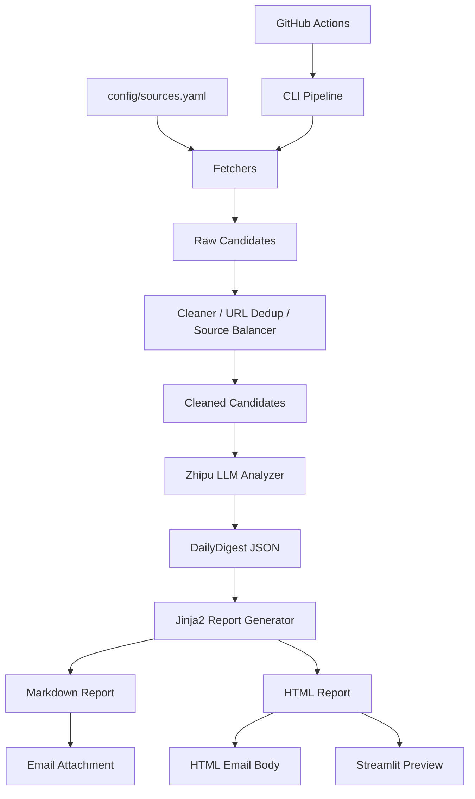

# ai-news-digest-agent

AI News Digest Agent is a modular AI-powered digest pipeline that collects public AI news, research papers, open-source signals, and industry updates, then uses an LLM to generate structured Chinese Markdown/HTML reports with optional email delivery, Streamlit UI, CLI, and GitHub Actions automation.

## Current Status
- Module 0-9 completed and verified locally.
- Optimization Round 1 completed: research/industry balance, source balancing, JSON repair, digest policy.

## Content Strategy
This project is designed as a **research + industry trend digest**, not a paper-only summary list.

It combines:
- AI research progress
- AI technology and model updates
- Agent / AI tooling trends
- company and industry dynamics
- open-source ecosystem signals
- compute/chip/infrastructure signals
- safety/policy/regulation updates

## Architecture


## Demo Output
A typical digest structure includes:
- 技术与模型进展
- 科研与论文前沿
- Agent 与 AI 工具
- 产业与公司动态
- Appendix

## Sources / Data Sources
The source list is managed in `config/sources.yaml`.

- Stable endpoints are enabled by default.
- Unverified endpoints stay `enabled: false` with TODO notes.
- Public content only: no login/paywall/captcha bypass.

## Screenshots
Screenshots can be added under `docs/assets/`.

Planned files:
- `docs/assets/streamlit-demo.png`
- `docs/assets/email-demo.png`
- `docs/assets/report-demo.png`

## Configuration
- `.env`: runtime secrets/config (never commit)
- `config/sources.yaml`: source definitions and enable flags
- `config/digest_policy.yaml`: balancing quotas and digest policy

## Manual Verification
```bash
python tests/manual_test_config_models.py
python tests/manual_test_digest_policy.py
python tests/manual_test_fetchers.py
python tests/manual_test_cleaner.py
set LLM_TEST_CANDIDATE_LIMIT=10
python tests/manual_test_llm.py
python tests/manual_test_report.py
python tests/manual_test_email.py
python tests/manual_test_pipeline.py
streamlit run app.py
```

## Limitations
- Free/flash LLM models may hit 429 / timeout.
- Some source feeds may change, timeout, or return 404.
- No database persistence in current version.
- No historical trend RAG in current version.
- No bypass of login/paywall/captcha/strong anti-bot controls.
- GitHub Actions requires repository Secrets configuration.

## Roadmap
- More high-quality sources
- Better source health dashboard
- UI screenshots
- Lightweight offline unit tests
- Optional multi-model support
- Historical trend analysis in the future

## Repo Hygiene
- Do not commit `.env`
- Do not commit runtime data under `data/` and `outputs/`

## Long-run Architecture Optimization (Latest)

### What Changed
- Fixed topic override propagation across Streamlit, CLI, pipeline, and LLM analysis.
- Added staged candidate pool controls:
  - `raw_candidates`
  - `cleaned_candidates`
  - `cluster_input_candidates`
  - `event_clusters`
  - `final_llm_events`
- Added deterministic event clustering for multi-source event merge before final digest generation.
- Added layered LLM mode (`single` / `layered`) with safe fallback to candidate-based flow.
- Expanded Chinese source configuration with enabled public feed candidates and disabled TODO official sources.

### Topic Override
- Streamlit `Topic` input now passes into `run_full_pipeline(..., topic_override=...)`.
- CLI now supports `--topic` for `fetch`, `analyze`, and `run-pipeline`.
- Final digest `topic` field is forced to override value when provided.

### Candidate Pool Controls
Environment variables:
- `MAX_RAW_CANDIDATES`
- `MAX_CLUSTER_INPUT_CANDIDATES`
- `MAX_LLM_EVENTS`
- `MAX_LLM_CANDIDATES` (backward-compatible)
- `MAIN_DIGEST_MIN_ITEMS`
- `MAIN_DIGEST_MAX_ITEMS`
- `APPENDIX_MAX_ITEMS`

### Layered LLM Pipeline
Environment variables:
- `LLM_PIPELINE_MODE=single|layered`
- `LLM_PREPROCESS_ENABLED=true|false`
- `LLM_PREPROCESS_PROVIDER`
- `LLM_PREPROCESS_MODEL`
- `LLM_FINAL_PROVIDER`
- `LLM_FINAL_MODEL`
- `LLM_REPAIR_PROVIDER`
- `LLM_REPAIR_MODEL`

If layered mode fails, pipeline falls back to candidate-based digest generation.

### Compliance Note
- Public-source-only collection.
- No login/paywall/captcha bypass.
- No Selenium/Playwright/browser automation scraping.
- `.env` must never be committed.

## Streamlit Usage (Updated)

Run:
```bash
streamlit run app.py
```

In sidebar:
- `Topic`: passed through to pipeline (`topic_override`) and used in final digest topic.
- `Final events/candidates sent to LLM`: passed as `llm_candidate_limit`.
- `Send email after full pipeline`: when enabled, full pipeline triggers email step.
- `Email dry run`: when enabled, email logic is executed but SMTP send is skipped.

### Email Config For Streamlit
Required env vars:
- `SMTP_HOST`
- `SMTP_PORT`
- `SENDER_EMAIL`
- `SMTP_AUTH_CODE`
- `RECIPIENT_EMAIL` or `RECIPIENT_EMAILS`

Optional:
- `MAX_RECIPIENTS_PER_RUN`
- `SEND_EMAIL`
- `DRY_RUN`

### Report-only / Email-only
- Report only: click `Generate Report Only`.
- Email only: click `Send Latest Email`.

### Manual Verification (Streamlit logic)
```bash
python tests/manual_test_streamlit_logic.py
```

`.env` should never be committed.
