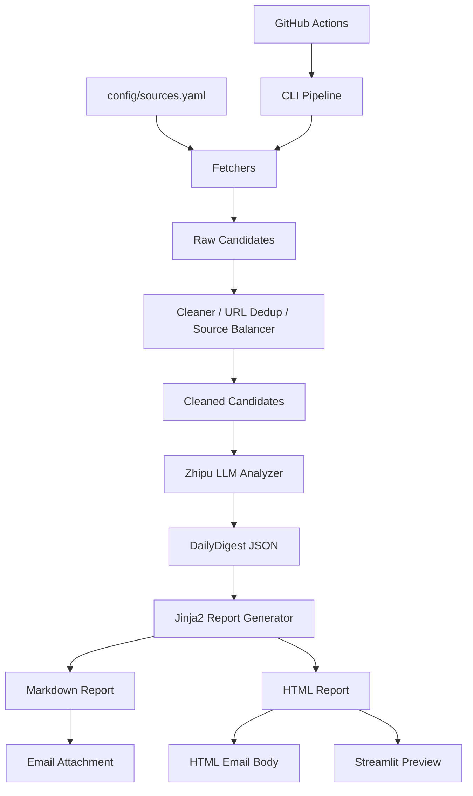

# ai-news-digest-agent

AI News Digest Agent is a modular AI-powered digest pipeline that collects public AI news, research papers, open-source signals, and industry updates, then uses an LLM to generate structured Chinese Markdown/HTML reports with optional email delivery, Streamlit UI, CLI, and GitHub Actions automation.

## Current Status
- Module 0-9 completed and verified locally.
- Optimization Round 1 completed: research/industry balance, source balancing, JSON repair, digest policy.

## Content Strategy
This project is designed as a **research + industry trend digest**, not a paper-only summary list.

It combines:
- AI research progress
- AI technology and model updates
- Agent / AI tooling trends
- company and industry dynamics
- open-source ecosystem signals
- compute/chip/infrastructure signals
- safety/policy/regulation updates

## Architecture


## Demo Output
A typical digest structure includes:
- 技术与模型进展
- 科研与论文前沿
- Agent 与 AI 工具
- 产业与公司动态
- Appendix

## Sources / Data Sources
The source list is managed in `config/sources.yaml`.

- Stable endpoints are enabled by default.
- Unverified endpoints stay `enabled: false` with TODO notes.
- Public content only: no login/paywall/captcha bypass.

## Screenshots
Screenshots can be added under `docs/assets/`.

Planned files:
- `docs/assets/streamlit-demo.png`
- `docs/assets/email-demo.png`
- `docs/assets/report-demo.png`

## Configuration
- `.env`: runtime secrets/config (never commit)
- `config/sources.yaml`: source definitions and enable flags
- `config/digest_policy.yaml`: balancing quotas and digest policy
- `data/recipients.local.json`: local recipients list for Streamlit/CLI recipient management (do not commit real emails)
- `config/recipients.example.json`: example recipients template committed to repo

## Recipient Management
- Local recipients file: `data/recipients.local.json`
- Example file: `config/recipients.example.json`
- Real mailbox addresses should stay local only and must not be committed to GitHub.
- If `data/recipients.local.json` is missing, app/CLI falls back gracefully and you can still send via `RECIPIENT_EMAIL`.

## Streamlit Email Sending
- Open `streamlit run app.py`, then go to `Email Recipients` tab.
- Add/update/remove recipients in local JSON (name/email/groups/enabled/note).
- Select enabled recipients and send latest digest directly.
- Input temporary emails (comma/semicolon/newline separated) and send without saving.
- Optional: check "Save these recipients" to write temporary emails into local recipients list.

## Manual Verification
```bash
python tests/manual_test_config_models.py
python tests/manual_test_digest_policy.py
python tests/manual_test_fetchers.py
python tests/manual_test_cleaner.py
set LLM_TEST_CANDIDATE_LIMIT=10
python tests/manual_test_llm.py
python tests/manual_test_report.py
python tests/manual_test_email.py
python tests/manual_test_pipeline.py
python tests/manual_test_recipients.py
streamlit run app.py
```

## CLI Examples
```bash
python cli.py send-email --to a@qq.com,b@qq.com
python cli.py send-email --group default
python cli.py run-pipeline --send-email --group default
```

## Limitations
- Free/flash LLM models may hit 429 / timeout.
- Some source feeds may change, timeout, or return 404.
- No database persistence in current version.
- No historical trend RAG in current version.
- No bypass of login/paywall/captcha/strong anti-bot controls.
- GitHub Actions requires repository Secrets configuration.

## GitHub Actions Recipient Note
- GitHub Actions still uses `RECIPIENT_EMAIL` repository secret for scheduled sends.
- Local `data/recipients.local.json` does not participate in GitHub Actions.
- If you need cloud-side recipient list management in the future, design separate secure storage first.

## Roadmap
- More high-quality sources
- Better source health dashboard
- UI screenshots
- Lightweight offline unit tests
- Optional multi-model support
- Historical trend analysis in the future

## Repo Hygiene
- Do not commit `.env`
- Do not commit runtime data under `data/` and `outputs/`
