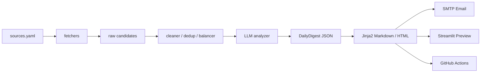

# ai-news-digest-agent

A modular AI News Digest Agent that aggregates public AI news, papers, open-source signals, and industry updates, then uses an LLM to produce a structured Chinese daily digest with Markdown/HTML outputs, SMTP email delivery, CLI orchestration, Streamlit UI, and GitHub Actions scheduling.

## Current Status
Module 0-9 completed and verified locally.

## Content Strategy
This project is positioned as an **AI research + industry trend digest**:
- AI research progress and paper frontier
- AI model and technology updates
- Agent and AI tool trends
- company/product and commercialization signals
- open-source and developer ecosystem
- compute/chips/infrastructure signals
- safety/policy/regulation updates

arXiv is kept as a key source, while candidate balancing controls paper-heavy output by default.

## Architecture


## Configuration
- `.env`: runtime secrets and switches (do not commit)
- `config/sources.yaml`: source list and enable flags
- `config/digest_policy.yaml`: source quotas + digest category strategy

## Data Sources
Enabled sources include stable public endpoints such as:
- HN Algolia API
- arXiv API
- GitHub Trending page
- selected public RSS feeds (e.g. OpenAI/Microsoft/NVIDIA/Hugging Face/TechCrunch)

Some sources remain TODO/disabled until stable public RSS or compliant endpoint is confirmed.

The project only fetches public content and does **not** bypass login/paywall/captcha.

## Manual Verification
No-API checks:
```bash
python tests/manual_test_digest_policy.py
python tests/manual_test_balancer.py
python tests/manual_test_config_models.py
```

Fetching / preprocessing:
```bash
python tests/manual_test_fetchers.py
python tests/manual_test_cleaner.py
```

LLM / report / pipeline:
```bash
set LLM_TEST_CANDIDATE_LIMIT=10
python tests/manual_test_llm.py
python tests/manual_test_report.py
python tests/manual_test_pipeline.py
```

Email / UI / CLI:
```bash
python tests/manual_test_email.py
python cli.py --help
streamlit run app.py
```

## GitHub Actions
Workflow: `.github/workflows/daily_digest.yml`
- schedule: UTC 14:00 (Beijing 22:00)
- workflow_dispatch: manual trigger

Requires secrets for LLM + SMTP before production use.

## Limitations
- free/flash LLM models can hit timeout or 429
- some RSS sources are still TODO and disabled
- no database persistence in current version
- no historical trend RAG yet
- no bypass of login/paywall/captcha
- GitHub Actions requires repository secrets setup

## Roadmap
- source quality improvement and source health checks
- stronger category balancing and policy tuning
- trend-oriented prompt tuning iteration
- report screenshots for README showcase
- lightweight unit tests for core processors
- optional multi-model support (DeepSeek/Qwen)

## Repo Hygiene
- never commit `.env`
- never commit runtime outputs under `data/` and `outputs/`
